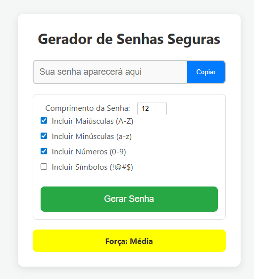

# 🔐 Gerador de Senhas

Um gerador de senhas simples e funcional que permite criar senhas fortes com apenas um clique.
Feito com **HTML, CSS e JavaScript puro**.

---

## 📸 Prévia



---

## 🚀 Acesse o Projeto

🔗 **Versão online (GitHub Pages):**
[https://rafaelamaral-dev.github.io/geradordesenhas/](https://rafaelamaral-dev.github.io/geradordesenhas/)

🔗 **Repositório no GitHub:**
[https://github.com/rafaelamaral-dev/geradordesenhas/](https://github.com/rafaelamaral-dev/geradordesenhas/)

---

## 🧠 O que é este projeto?

Um aplicativo que gera senhas aleatórias com base em critérios definidos pelo usuário.
Ideal para treinar manipulação de DOM, eventos e lógica de strings em JavaScript.

---

## 🛠 Tecnologias Utilizadas

* **HTML5**
* **CSS3**
* **JavaScript**

---

## 📌 Funcionalidades

✔ Gera senhas automaticamente
✔ Opção para copiar a senha
✔ Diferentes tamanhos de senha
✔ Interface leve e intuitiva
✔ 100% responsivo

---

## ▶️ Como Rodar Localmente

1. Faça o clone do repositório:

```bash
git clone https://github.com/rafaelamaral-dev/geradordesenhas.git
```

2. Entre na pasta:

```bash
cd geradordesenhas
```

3. Abra o arquivo `index.html` em qualquer navegador.

Pronto! O gerador estará funcionando.

---
